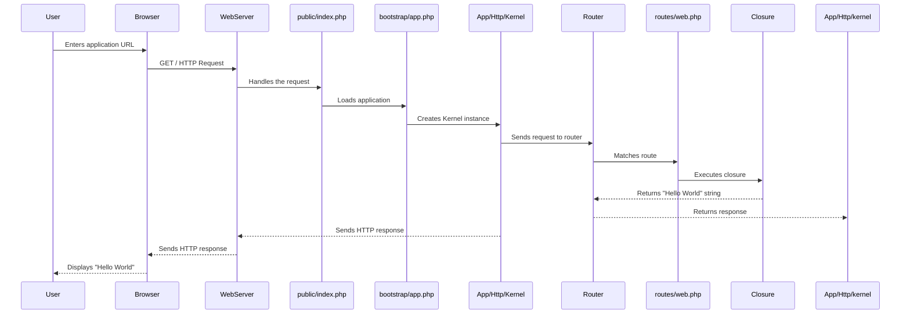

## Laravel Request Lifecycle: From Request to "Hello World"

This document outlines the sequence of events that occur in a Laravel application to display the "Hello World" string in a browser.

### Sequence Diagram



### Detailed Explanation

1.  **HTTP Request:** The user's browser sends an HTTP GET request to the application's root URL.

2.  **Public Directory:** The web server (e.g., Nginx, Apache, or the built-in PHP server) receives the request and directs it to the `public/index.php` file. This is the single entry point for all HTTP requests to the application.

3.  **Application Bootstrap:** The `public/index.php` file performs two main actions:
    *   It loads the Composer-generated autoloader file (`vendor/autoload.php`), which makes all the project's classes available without needing to manually include them.
    *   It gets a Laravel application instance from `bootstrap/app.php`. This file is responsible for creating and configuring the application instance.

4.  **HTTP Kernel:** The application's HTTP kernel, located at `App\Http\Kernel.php`, handles the incoming request. The kernel is responsible for processing a series of global middleware that the request must pass through before being handled by the router. These middleware can handle tasks like checking for maintenance mode, trimming strings, and converting empty strings to `null`.

5.  **Router:** After passing through the kernel's middleware, the request is sent to the router. The router is responsible for matching the request's URI (`/`) and HTTP method (`GET`) to a specific route definition.

6.  **Route Definition:** The router finds a matching route in the `routes/web.php` file. In this case, it finds the following definition:

    ```php
    Route::get('/', function () {
        return 'Hello World';
    });
    ```

7.  **Closure Execution:** The matched route is associated with a closure (an anonymous function). The router executes this closure.

8.  **Response Generation:** The closure returns the string "Hello World". Laravel automatically creates a new `Illuminate\Http\Response` object with the string as the content and a `200` status code.

9.  **HTTP Response:** The response is sent back through the kernel, where any terminable middleware can perform actions on the outgoing response.

10. **Response Sent:** The HTTP kernel sends the final response back to the web server.

11. **Browser Display:** The web server forwards the HTTP response to the user's browser, which then displays the "Hello World" string.
